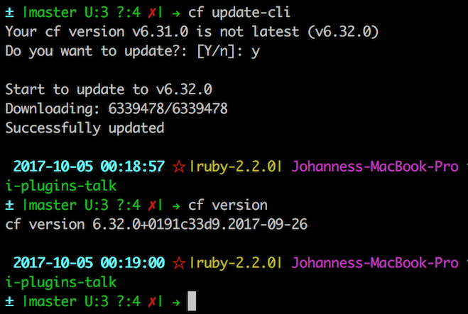

<!-- .slide: class="titlePage" -->

## CF Cli Plugins

#### Hacking Cloud Foundry for fun(c) and profit

Note:
Welcome and Introduction

---

## What are CLI Plugins


* Small binaries to add functionality to the CF CLI <!-- .element: class="fragment fade-in" data-fragment-index="1" -->

* Written in Go  <!-- .element: class="fragment fade-in" data-fragment-index="2" -->

* Communicating with CF CLI process via RPC  <!-- .element: class="fragment fade-in" data-fragment-index="3" -->

Note:
Little tools to enhance your CF experience

--

<br/>


 <!-- .element: class="fragment fade-out" data-fragment-index="1" -->
 <!-- .element: class="fragment fade-in" data-fragment-index="1" -->

Note:
Here you can see all the plugins that I have installed on my machine 

---

## Where do you get CLI Plugins

The plugin repository <!-- .element: class="fragment fade-in" data-fragment-index="1" -->

https://plugins.cloudfoundry.org <!-- .element: class="fragment fade-in" data-fragment-index="1" -->

--


Note:
W

---

## How do you install CLI Plugins

--

```
$ cf add-plugin-repo CF-Community https://plugins.cloudfoundry.org
$ cf install-plugin -r CF-Community "service-use"

Searching CF-Community for plugin service-use...
Plugin service-use 1.0.1 found in: CF-Community
Attention: Plugins are binaries written by potentially untrusted authors.
Install and use plugins at your own risk.
Do you want to install the plugin service-use? [yN]: y
Starting download of plugin binary from repository CF-Community...
 9.39 MiB / 9.39 MiB [===========================================] 100.00% 18s
Installing plugin ServiceUsePlugin...
OK
Plugin ServiceUsePlugin 1.0.1 successfully installed.

$ cf service-use

```


Note:
show commands

---

## Great plugins

--

### cf top


--

### cf update-cli



--

### Zero-Downtime and Blue/Green Deployments

* `cf blue-green-deploy`
* `cf autopilot`
* `cf bg-restage`
* `cf scaleover-plugin`
* `cf recycle-plugin`

--

### cf mysql

--

### cf willitconnect

--

### cf open

--

### cf fastpush

--

### cf service-connect

---

## Write your own

- Has to be in go
- Extensive and fairly stable API

## Components of a plugin

### main.go


---

### test.go


## Publishing your plugin


---

Note:
- Has to be in go
- API for plugin development rather stable
- Cumbersome to publish
- Hard to test
